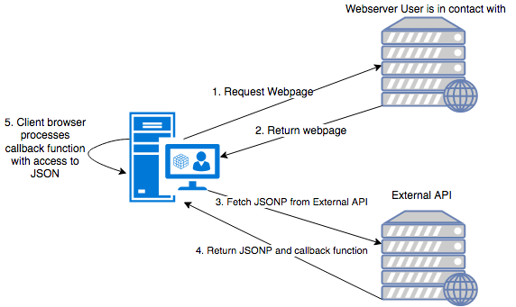
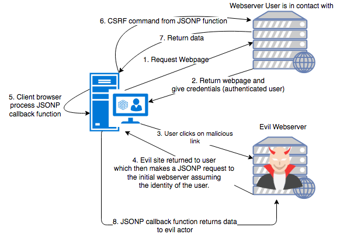

# JSONP Vulnerabilities
## The Wild West
Long ago there were no protections against cross origin data requests. 
This meant that you could grab information from any site with XMLHttpRequests,
which was a much desired feature for developing websites. This let you shift getting data
from external APIs to the front end, instead of having to set up a backend service to 
act as a middle man for fetching data. 
## The Problem With The Wild West
This lead to some security issues, however, because hackers could craft clever CSRF 
attacks to intercept the AJAX requests and steal the data. That's a big issue, so developers got to work 
creating a patch at the browser level.
## How Did Developers Stop This?
To prevent this, most browsers implemented a [Same Origin Policy](https://en.wikipedia.org/wiki/Same-origin_policy).
The SOP disallowed communications from sources with different domain names, protocols, and port numbers. This 
prevented attackers from creating CSRF AJAX interceptions because the browser would recognize that the user
unknowingly was trying to load code referencing another origin. In most cases, a good site would not try 
to do that. Some legitimate uses of a cross origin request could be
* Hitting an endpoint on a different subdomain, say `api.foo.com` from `foo.com`
* Loading data from an API from the front end.
To bypass this, developers started using Javascript Serialized Object Notation with Padding (JSONP).
## JSONP? Never Heard Of It
*A JSON Hijacking attack is an attack on webservers, not the browser of the user, persay.*
Wikipedia has a very succinct definition of JSONP. 
"[JSONP](https://en.wikipedia.org/wiki/JSONP) is a javascript pattern to request data by loading a 
`<script>` tag... JSONP enables sharing of data bypassing the Same Origin Policy". Browsers
have to enable the use of the `<script>` tag. Without it, almost every site we know today would not
function. Requesting JSON by itself with a `<script>` tag is technically valid, because JSON data 
is Javascript. However, the browser would interpret this as a block of code with no function, conditional, 
or loop surrounding it. Therefore, the browser would throw a syntax error and not load the page.
So, someone clever proposed the idea of wrapping a returned JSON object in a Javascript function,
and specify the callback function on the request to be said function. For this to work, the API in
which the user called must be expecting to return *JSONP*, not just standard JSON. Now let's look at
the standard architecture of JSONP. 

Here we have a good actor legitimately using JSONP.

## How The Attack Works
An evil actor could craft a page that the user visits, with a script tag linking to a JSONP using site that the user is authenticated to. The code would be rendered on the clients screen, which would then access the clients cookies to complete an authenticated action on the legitimate server (assuming cookie session storage). The request returned by the good server can then be forwarded to the malicious server. Here is how an evil actor would steal information. A JSONP attack sounds a lot like a CSRF attack, because it is one. If a site is vulnerable, and a user is authenticated with sesion cookies, an evil actor can steal a good actor's credentials and perform actions on their behalf. Note that this attack requires **TWO** origins, which can be accomplished on a localhost with **TWO webservers** running on **TWO different ports**. 

## Mitigating JSONP Attacks
Modern sites are not susceptible to this because modern servers don't implement JSONP because it's not safe.

To achieve the same result (getting cross origin information), it is recommended that you make a proxy server within your origin that can ping an external entity, then return that to the front end.

In addition to SOP, there are now [Cross Origin Resource Sharing policies](https://en.wikipedia.org/wiki/Cross-origin_resource_sharing) (CORS) that defines how a browser and server can interact. The CORS policies are now attatched in HTTP Request and Response headers to define the interaction. 
